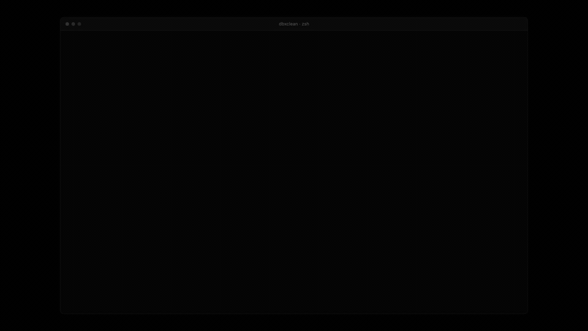

# dbxclean

Find duplicate files and set them aside safely, with a keyboard driven
interface. Nothing is ever deleted.



That is a real run: thirty files in six duplicate groups, the review screen,
the move into quarantine, and then `--restore` putting every file back where it
came from.

## Install and run

There are no dependencies. The interface is built on `termios` from the
standard library, so nothing is fetched beyond the package itself. Python 3.10
or newer.

```bash
pip install -e .
dbxclean
```

Arrow keys and enter, nothing typed in. You walk into a directory, review each
duplicate group, press space on the ones you want dealt with, and confirm once.

```bash
dbxclean --restore   put everything back
dbxclean --help      what it does
```

## What it will not do

The whole point of a deduplicator is that it cannot remove the wrong file, so
these are the rules it is built around.

**It never deletes.** There is no `os.remove` or `unlink` anywhere in it. Files
you select are moved into a `.dbxclean-quarantine` directory beside them, and
every move is logged, which is what makes `--restore` possible.

**It never removes the last copy.** A duplicate group always keeps one member,
chosen deterministically by shallowest path, then oldest, then alphabetical, so
a second run makes the same choice rather than a new one.

**It never acts without being told to.** Starting the tool scans and shows you
what it found. Nothing moves until you select groups and then confirm a prompt
that names how many files are affected and defaults to no.

**It never guesses what a duplicate is.** Files are grouped by SHA-256 of their
contents. Size is compared first only because it is free, and files that agree
on size but differ in bytes are not grouped.

[SAFETY.md](SAFETY.md) spells out the rest.

## Layout

```
src/dbxclean/cli.py     entry point, --restore and --help
src/dbxclean/tui.py     the directory picker and the review screen
src/dbxclean/safety.py  hashing, grouping, the quarantine and the undo log
src/dbxclean/keys.py    terminal bytes to key names
tests/test_safety.py    the quarantine round trip and the survivor rule
```

## Tests

```bash
pip install -e . pytest
pytest
```

Nine tests. They cover the round trip that matters: that a group always keeps a
member, that what is set aside is moved rather than removed, and that restoring
puts every path back exactly where it was.

## The web app

This repository also holds the first version of the idea, which is a browser
one: a FastAPI backend and a React frontend that work against the Dropbox API
instead of a local directory, with perceptual hashing for similar images,
quality scoring and renaming suggestions. It needs a Dropbox token, a database
and two processes.

It is documented separately, in [docs/web-app.md](docs/web-app.md), along with
[SETUP.md](SETUP.md) and [LOCAL_MODE.md](LOCAL_MODE.md).

## Contributing

This is a personal project. Feel free to fork and modify for your needs.

## License

MIT. See [LICENSE](LICENSE).

## Support

For issues or questions, please open an issue on GitHub.

