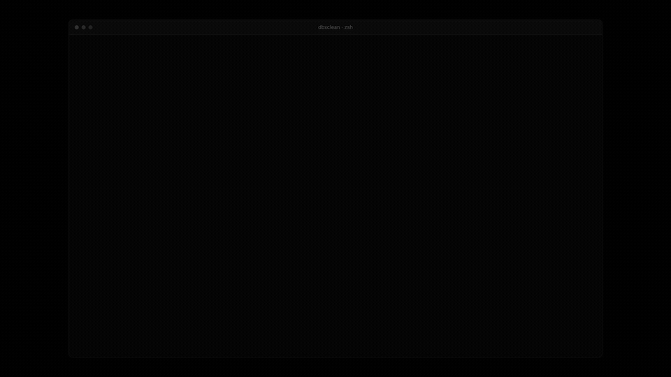

# dbxclean

dbxclean finds exact duplicate files and lets you review what to set aside. It has a keyboard driven command line interface for local files and a web app for Dropbox or local folders.



The recording shows a local run: 28 files in five duplicate groups, a review, a move into quarantine, and restoration to the original paths.

## Command line interface

The CLI needs Python 3.10 or newer and only uses the standard library at runtime.

```bash
python3 -m pip install -e .
dbxclean
```

Choose a directory with the arrow keys and Enter. Press Space to select duplicate groups, then confirm the move. No file moves during scanning or review. The CLI groups byte identical files using SHA-256, with size as a fast first check. It always leaves one deterministic copy in place and moves selected extras into `.dbxclean-quarantine` under the chosen directory. It logs each move.

```bash
dbxclean --restore /path/to/chosen/directory
```

With no directory argument, `--restore` uses the current directory. Restoration refuses to overwrite a path that now exists.

## Web app

The web app uses FastAPI and React. In Dropbox mode, the default scan reads paginated file metadata and compares Dropbox content hashes. It does not download file contents for exact duplicate detection. Similar image analysis is optional and reads image data or thumbnails. In local mode, the scan reads local files to calculate content hashes. Results are stored in SQLite and duplicate groups are paginated in the browser.

A confirmed cleanup of a reviewed file moves it into recovery. Dropbox mode uses Dropbox Deleted files and can restore a recorded revision while it remains within the account's retention period. Local mode moves the file into `.dbxclean-quarantine/web` and restores it from there. The server checks current metadata, rejects stale or unrelated selections, protects recommended files, and refuses to overwrite a destination during rename or restore. The old `/api/delete` route uses this same recovery flow.

See [web setup](docs/web-app.md), [local mode](LOCAL_MODE.md), and [safety rules](SAFETY.md).

## Verification

The tests use disposable local files and a simulated Dropbox client. No Dropbox app, token, or personal files are needed.

```bash
python3 -m pip install -e .
python3 -m pip install -r backend/requirements.txt pytest
npm --prefix frontend ci
./verify.sh
```

The separate 700,000-entry synthetic scan can be run with:

```bash
PYTHONPATH=src python3 -m backend.tests.large_scan_check
```

The credential-free checks do not verify an operation against a live Dropbox account.

## License

MIT. See [LICENSE](LICENSE).
